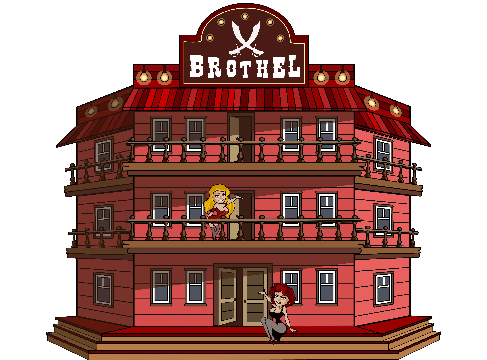

# The Brothel

<figure><figcaption></figcaption></figure>

***

#### Brothel Overview

**In Brief:**

* **Total Availability:** 250 units available for minting.
* **Functionality:** Works with a character assigned as a Whoremonger to produce stat bonuses for treasure hunts.
* **Resource Requirement:** Requires Bottles of Rum for operations (10 Bottles of Rum = 1 use).
* **Bonus Acquisition:** Go to The Seas -> Visit Brothels (use your own brothel or others') to receive bonuses.
* **Bonus Duration:** Bonuses are effective for 20 hunts.
* **Whoremonger Experience:** The Whoremonger gains EXP with each use of the brothel.
* **Whoremonger Lifecycle:** Expires after a set number of uses.
* **Usage Fee:** Owners can set a premium for others to use their Brothel.
* **Brothel Accessibility:** Owners can toggle between public or private access via Town -> Brothel.
* **Owner Rewards:** Owners are compensated each time their Brothel is used.
* **Potential Risk:** Bonuses can potentially lead to receiving a debuff called "gonorrhoea."

**Detailed Guide:**

**Operational Mechanics:**

* **Character Requirement:** A character must be staked in the Brothel to become a Whoremonger.
* **Bonuses and Debuffs:**
  * **Stat Bonuses:** When a character visits the Brothel, they receive a stat bonus applicable for 20 hunts. Bonuses are based on the Whoremonger’s EXP, adding a strategic layer to bonus management.
  * **Debuff Risk:** Visiting the Brothel may result in contracting "gonorrhoea," which nullifies any recently obtained bonus and applies additional negative effects.

**Leveling Up Whoremonger:**

* **Experience Gains:** Each brothel use provides EXP to the Whoremonger based on the rarity of the bonus requested: +3XP for common, +24XP for rare, or +72XP for legendary.
* **Max Level and Retirement:** Upon reaching the maximum level of 100, the Whoremonger can provide 100 more bonuses before expiring. A new character will then be required to continue operations.

**Financial Aspects:**

* **Fees:** Similar to the Forge, obtaining bonuses from the Brothel incurs a fee in rETH. The distribution is 80% to the building owner and 20% to the protocol.
* **Premium Fee:** Owners can charge an additional amount in FLAG for using their Brothel, influencing the economic interactions within the game.

**Management Settings:**

* **Public/Private Mode:** Owners can decide whether to make their Brothel publicly accessible to all players or private for their exclusive use.

**Note:** The Brothel adds a unique element of risk and reward to the game, influencing player strategies and interactions. The feature is designed to provide a dynamic and engaging player experience, with adjustments possible to ensure balanced and enjoyable gameplay.\
\
