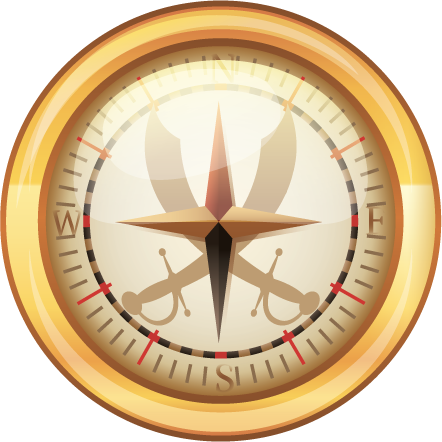

# The Compass

<figure><figcaption></figcaption></figure>

**The Compass**:

* Type: ERC1155, Consumable Item
* Tied to individual addresses
* Used in: Legendary hunts (PVE) & legendary travels (PVP)

**Benefits**:

1. Burn Protection
2. Staking points offer a slim chance to obtain a building. (Rest assured, the odds are so low that there's virtually no risk of inflation.)

Once the burn protection is activated or a building is acquired, the compass is burned🔥.

**Acquisition**:

* Presale event
* Possible rewards from victories in legendary hunts (PVE) or legendary travels (PVP).
* Free airdrops based on the amount of FLAG staked.

