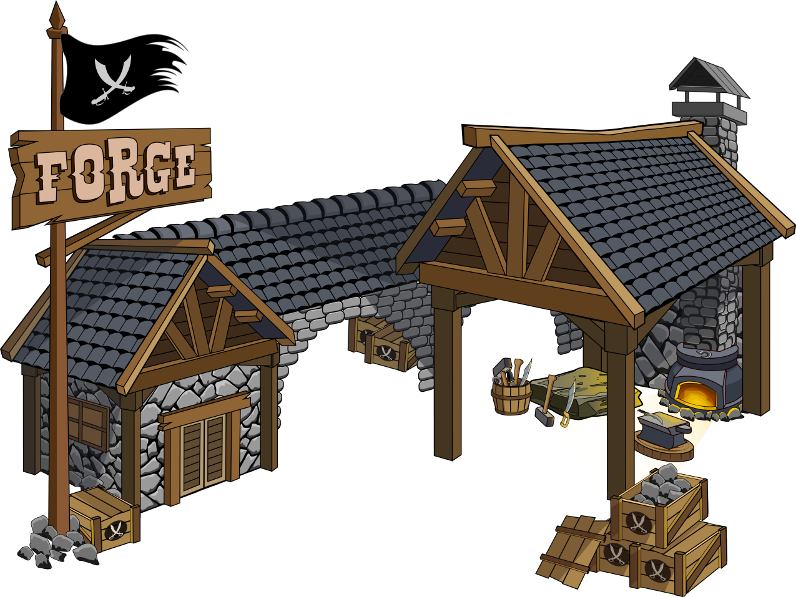

# The Forge

<figure><figcaption></figcaption></figure>

***

#### Forge Overview

**In Brief:**

* **Total Availability:** 575 units available for minting.
* **Functionality:** Crafts gear (main hand, leg, feet, head, chest) when a character is assigned as a Blacksmith.
* **Resource Requirement:** Requires $rhum for Blacksmith operations (10 $rhum = 1 use).
* **Gear Crafting:** Go to Crew -> Craft gears (using your own forge or others'). Requires Coins for crafting.
* **Equipping Gear:** To equip a crafted gear, navigate to Crew -> Inventory -> Equip gear.
* **Marketplace Interaction:** Gears can be used, bought, or sold in the marketplace.
* **Blacksmith Experience:** The Blacksmith gains EXP with each forge use.
* **Blacksmith Lifecycle:** The Blacksmith expires after crafting a set number of gears.
* **Usage Fee:** Owners may set a FLAG premium for others to use their Forge.
* **Forge Accessibility:** Owners can toggle between public or private access via Town -> Forge.
* **Owner Rewards:** Forge owners receive rewards each time their Forge is used.

**Detailed Guide:**

**Crafting Process:**

* **Character Requirement:** A character must be staked in the Forge to become a Blacksmith.
* **Operational Cost:** Crafting gear requires a combination of rETH and Coins. The cost includes a fee in rETH + 1000 Coins which may vary based on the current market conditions.
* **Revenue Distribution:** Owners can charge an additional amount in FLAG for using their Forge, influencing the economic interactions within the game. 90% of the premium fee in FLAG goes to the building owner, while 10% fill the Royalty Reserve.

**Blacksmith Development:**

* **Experience Gains:** Each forge use provides EXP to the Blacksmith based on the rarity of the Coins used: +4XP for common, +24XP for rare, or +72XP for legendary gear crafting.
* **Skill Level Impact:** The higher the Blacksmith’s skill level, the better the stats of the crafted gears.
* **Max Level and Retirement:** Upon reaching the maximum level of 100, the Blacksmith can craft an additional 100 gears before expiring. A new character will then be required to continue crafting.

**Gear Statistics:**

* **Stat Generation:** Gear stats are randomly generated, adding significant variety and unpredictability to gear crafting.
* **Coin Types for Rarity:** Use Silver Coins for rare gears and Gold Coins for legendary gears.

**Forge Management:**

* **Public/Private Mode:** Owners can set their Forge to be publicly accessible to all players or private for their use only.

**Note:** The Forge is a critical component of the game, providing essential equipment for character development and strategic gameplay. This system is designed to engage players in the economic and tactical aspects of the game, ensuring a rich and interactive experience.

