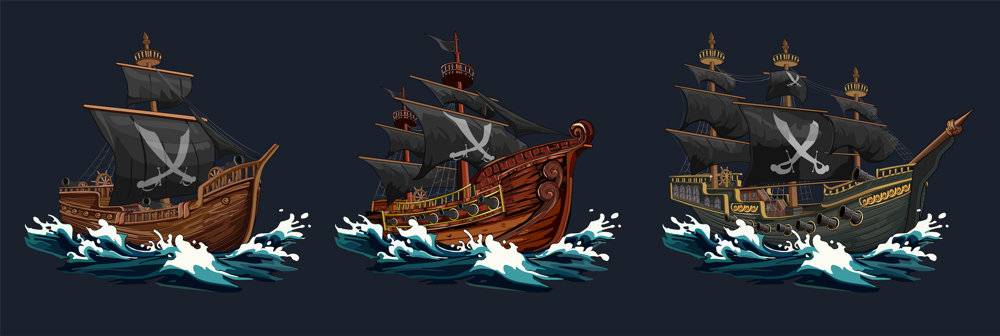

# The Ships

<figure><figcaption></figcaption></figure>

***

#### Ship Construction Guide

**1. Introduction**

The Shipyard and Shipwright are crucial facilities that allow players to craft ships uniquely suited to their strategic preferences in the game. The ability to construct a well-designed ship is fundamental for anyone aiming to dominate the high seas.

**2. Crafting a Ship**

**Cost:**\
Crafting a ship requires a payment in rETH + $FLAG premium setup by the shipyard owner.

**Distribution:**\
80% of the crafting fee is allocated to the building owner, and the remaining 20% supports the protocol.

**Ship Bonuses:**\
The bonuses or maluses a ship receives depend on the Shipwright’s level, which can range from +10% to +30% for bonuses, and -10% to -30% for maluses.

**Ship Types:**

* **Pirate:** Specializes in crafting Caravels.
* **Corsair:** Focuses on producing Schooners.
* **Smuggler:** Known for creating Square Rigs.

**Note:** Each character class is restricted to crafting only their specific type of ship.

**Ship Stats:** The stats of a ship are significantly influenced by the equipment it carries and the captain aboard. Once a captain is assigned to a ship, their individual stats become the ship’s base stats.

**3. Ship Class Bonuses**

**Caravel:**

* **Bonus:** Improved boarding capabilities.
* **Malus:** Reduced charisma.

**Schooner:**

* **Bonus:** Enhanced sailing performance.
* **Malus:** Weaker boarding abilities.

**Square Rig:**

* **Bonus:** Increased charisma.
* **Malus:** Decreased sailing efficiency.

**Captain Bonuses**

* **Pirates:** Receive an additional 20% boarding bonus.
* **Corsair:** Gain an extra 20% charisma bonus.
* **Smuggler:** Obtain a 20% increase in sailing bonus.

