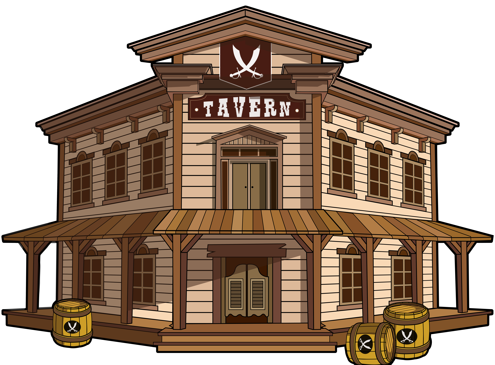
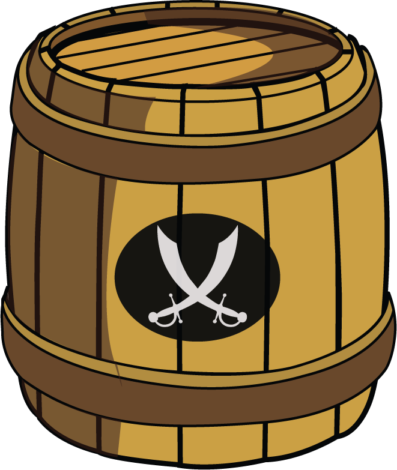

# The Tavern

<figure><figcaption></figcaption></figure>

**In brief :** \
\- 999 in total will be available to mint\
\- Stake it using the dapp to produce $BARRELS (ERC20)\
\- To stake go to Town -> Tavern -> Stake button\
\- Works without a character assigned to it\
\- Produce $BARRELS of Rum that can be converted into Bottles of Rum (ERC1155)\
\- Use produced $BARRELS produced\
\- Sell Bottles of Rum on the marketplace\
\- Level it up to produce +10% more $Barrels at each level up\
\- Give Bottles of Rum to your characters for them to be able to do everything within the game\
\
**In details :** \
This building can be obtained by mint. It produce $BARRELS of Rum once the building is staked. You can claim your $BARRELS whenever you want clicking the "claim" button under each tavern within the Dapp. Note that this building do not need to have a character assigned to it.



To Level up the tavern it cost 20 Matic\* + 1000 $BARRELS for level 1 and after +20% of $BARRELS for each additional levels. The Matic price is fixed no matter what level you level up to. You get +10% of $BARRELS production per level. \
\

A halving on the general production is triggered if the total $BARRELS circulating supply goes above 1.000.000. The halving is automatically cancelled if it goes below.

 \
\
1 $BARREL = 100 Bottles of Rum\
Above your Tavern, you can click "Bottling" to obtain your bottles (to use or sell on the marketplace)\
\
_\*The amount may sound expensive but it regulates the_ $BARRELS _production and raise consequently the endgame rewards. The money goes straight to the end-game and so, goes back to the winners (PVP Chapter II)._ 

\
\
See also : [usdrhum-tokenomic.md](../../economy-tokens-lp/usdrhum-tokenomic.md "mention")  and [earn-and-endgame.md](../economy-burn-and-earn-system/earn-and-endgame.md "mention")

<figure><figcaption>
Bottle of Rum
</figcaption></figure>

<figure><figcaption>
$BARRELS
</figcaption></figure>
