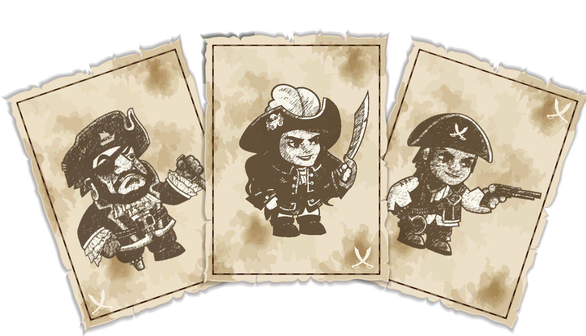

# Tickets & Characters

### THE TICKETS

<figure><figcaption></figcaption></figure>

\

**In brief :** \
\- 1 NFT pirate = 3 tickets (one of each)\
\- One ticket = 1 character's mint\
\- You can mint characters in -> Town -> Characters\
\- Can be sold or bought within the marketplace

**In details :** \
Obtained by owning an NFT pirate. These tickets can be used to mint the game's characters. Every NFT pirate gives you 1 ticket for each character (Smuggler, Corsair, Pirate). There is a cooldown each time you mint your tickets.&#x20;

<figure><figcaption></figcaption></figure>

\
\

**In brief:**

* Unlimited supply with a burn mechanism and a mint cooldown.
* Your characters are in -> Crew -> Inventory
* You can mint characters in -> Town -> Characters
* Level them up to rare (level 30).
* Level them up to legendary (level 70).
* Provide them with drinks (Bottles of Rum obtained from $BARRELS) to enable certain actions.
* Send them on treasure hunts for EXP and coins.
* Equip them with gear from the Forge to enhance their stats and EXP.
* Apply bonuses for the hunt using the Brothel.
* Assign them to a building (careers).
* The character with the highest stats is always displayed at the top of your inventory.
* Delegation is available to minimize the need for repeated clicking or to rent it out.

**In details :** \
ERC1155. These are your Pirates. You can mint them using the tickets provided by your PIRATE NFT once per 3 months.&#x20;

There are three types of characters: the Smuggler (1), the Corsair (2), and the Pirate (3). These classes will gain significance later in Chapter II but won't hold much importance during Chapter I.

All characters start without gear and at level zero, featuring randomly generated stats for boarding, charisma, and navigation using Chainlink. Gears consist of items like Head, chest, main hand, leg, feet. These gear stats contribute to the character's overall attributes and can be obtained in the Forge building in exchange for Coins. Further details about this can be found in the Forge description.

Characters serve a purpose in treasure hunts to acquire Coins and EXP. Experience points are essential for leveling up characters, and their significance will persist throughout all chapters of the game. For more information, refer to the Hunt description. In later stages, EXP will also be relevant for PvP (Chapter II).

Character's Career: Characters can be assigned to various buildings. They can become a Blacksmith in the Forge, a Whoremonger in the Brothel, and a Shipwright in the Shipyard. Once a character is assigned to a building, the decision is permanent, and they cannot be removed or change their career.\
\

