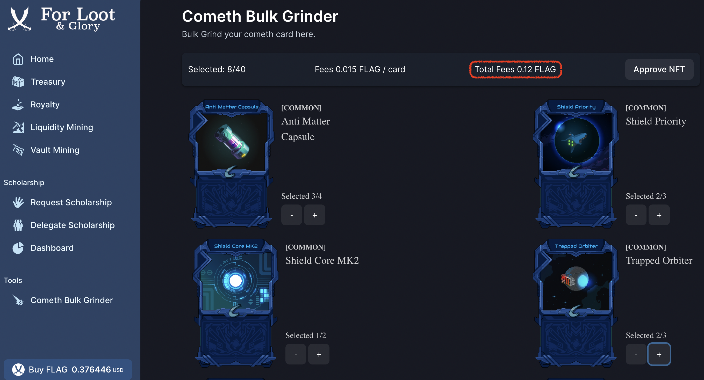

# Our Cometh Bulk Grinder

Here you will be able to choose the cards and the quantity of cards you want to grind, but for this you will need to have a minimum of FLAG in your wallet ([Buying FLAG](../economy-tokens-lp/usdflag-tokenomic/buying-flag.md)) and approve the token first.

<figure><figcaption></figcaption></figure>

Depending on the amount of cards (by pressing -/+) you want to grind, you will have the amount of fees to pay displayed here.

Please find below the details of the **FLAG request fees** according to your role:

* for <mark style="color:green;">Fresh-water sailors</mark> : 0.06 FLAG per card
* for <mark style="color:blue;">Looters</mark> : 0.03 FLAG per card
* for <mark style="color:purple;">Fleet commanders</mark> : 0.015 FLAG per card

Then just click approve NFT and confirm the transaction to receive the resources of the grind in your wallet

<figure><figcaption></figcaption></figure>

:warning:Note : depending on the evolution of the Flag token, the fees will be adjusted accordingly
